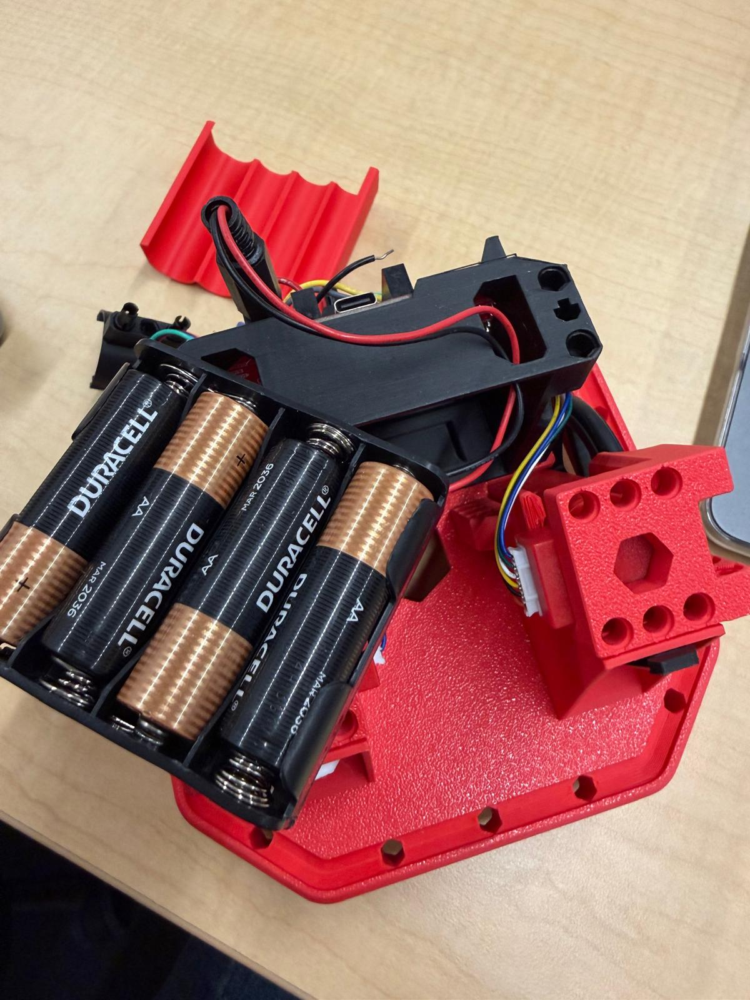
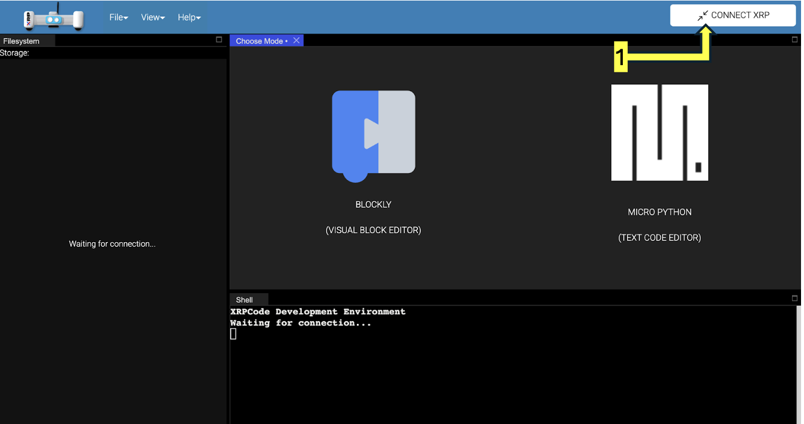
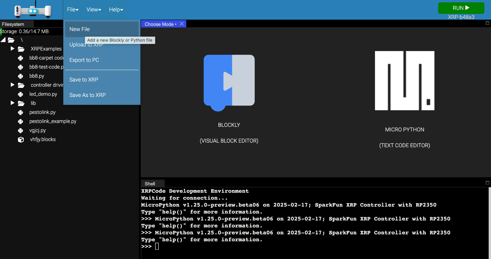
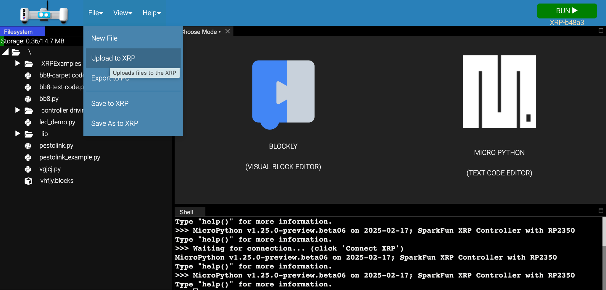
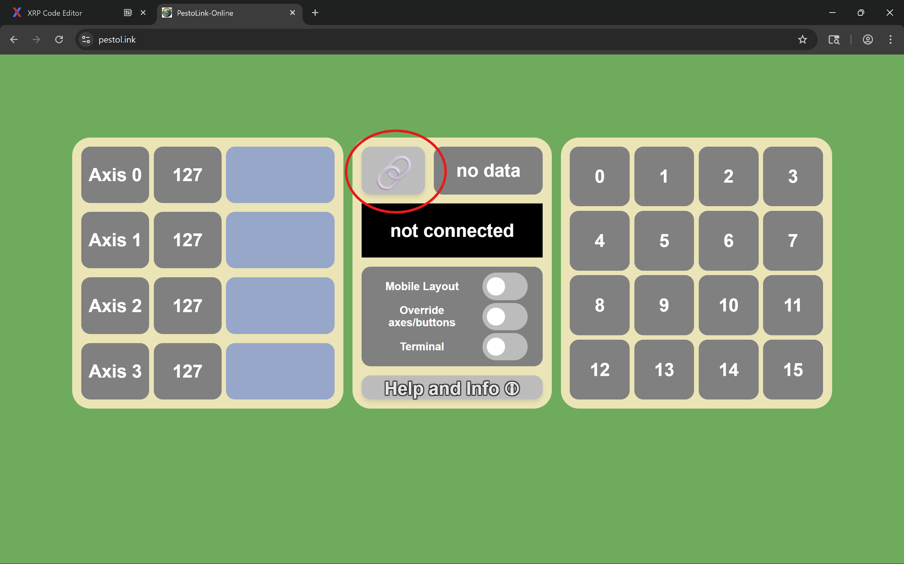
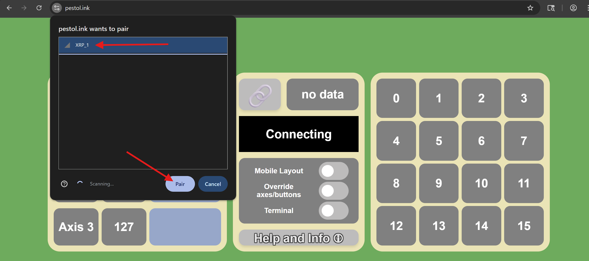
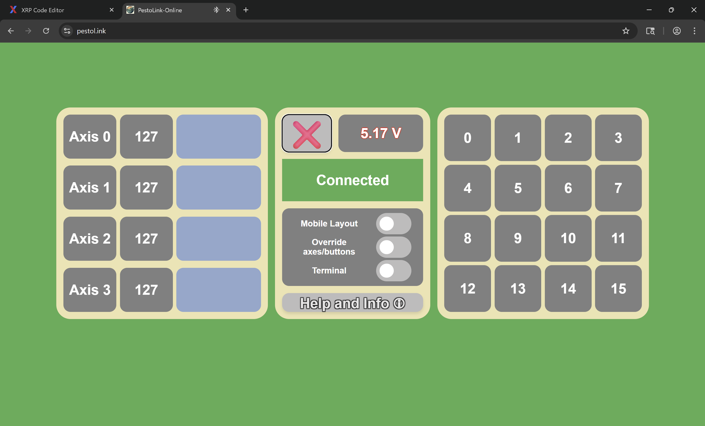
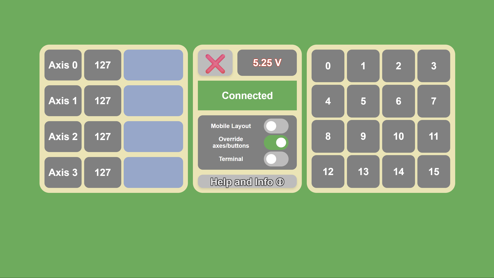

# Quick Start Guide

This section gets you from unboxing to driving your XRP in the shortest path possible. Detailed explanations follow in later sections.

## Main Components

The XRP is comprised of the following main components:

-   **XRP Controller Board** – The "brain" of the robot. Includes a Raspberry Pi Pico W microcontroller, a built-in 6-axis IMU, a Qwiic connector for add-on sensors, a user push-button, and an indicator LED.
-   **Chassis Set** – Plastic frame and body pieces that snap together tool-free. Lego-compatible connections included.
-   **Motors and Wheels** – Two motors with built-in encoders (for measuring rotation) and two rubber O-ring tires. Can spin clockwise or counterclockwise at various speeds to drive left and right sides of the robot.
-   **Servo Motor** – A motor you can control the position of (within its limits). Includes a Lego-compatible hub for attachments.
-   **Ultrasonic Distance Sensor** – Measures distance using ultrasonic sound waves. Typically mounts on the front to detect obstacles.
-   **IR Reflectance Sensor Board** – Two infrared (IR) sensors for line-following applications.
-   **Color Sensor** – Detects whether the detected color matches a programmed color.
-   **Touch Sensor / Button** – A large push-button for user input or binary bump detection.
-   **Battery Holder** – 4 AA battery pack with barrel plug connector.

------------------------------------------------------------------------

## Step 1: Power On & Connect

1.  Ensure 4 AA batteries are installed and the power switch (on the controller board) is **ON**.

::: {style="display: flex; gap: 1em;"}
 
:::

2.  Connect the XRP to your computer with a USB-C cable.

3.  Open the XRP Code Editor in Google Chrome: <https://xrpcode.wpi.edu/>(USB or Bluetooth options available — connect with USB for now). Click **CONNECT XRP** in the top right corner.



4.  The editor should auto-detect your XRP. If not, click the connect button and select the device.

------------------------------------------------------------------------

## Step 2: Run Your First Program

1.  In the code editor, create a new MicroPython file via **File → New File**.



2.  Paste the following test code:

``` python
from XRPLib.defaults import *
drivetrain.straight(20, 0.5)  # Drive 20cm at 50% effort
```

3.  Click **Run**. Your robot should drive forward 20 cm.
4.  Find the full sample program `example_run.py` on Canvas, which covers all XRP kit features.

------------------------------------------------------------------------

## Step 3: Connect PestoLink + Game Controller

You'll load code onto the robot that allows you to drive it with a game controller (USB or Bluetooth).

### Upload PestoLink Files

1.  Download the PestoLink code: <https://github.com/AlfredoSystems/PestoLink-MicroPython/archive/refs/heads/main.zip>

    The zip contains these files:

    

2.  Upload `pestolink.py` to the XRP's `lib` folder. In the code editor go to **File → Upload to XRP**.

    

    Select `pestolink.py` from the file picker.

    

    Save it to `/lib/pestolink.py`.

    

3.  Upload `pestolink_example.py` to the XRP the same way. Save it to `/pestolink_example.py`.

    

4.  Open `pestolink_example.py` on the XRP and update `robot_name` to whatever you want (max 8 characters).

    

### Run & Pair

1.  Hit the **RUN** button in the top right corner. The servo will move to a 50° angle to confirm the program is running.

2.  In another tab, open <https://pestol.ink/>and click the **link icon** to pair your robot.

    

3.  Select your device and click **Pair**.

    

    -   If you don't see your robot's name, turn the robot off, close the PestoLink tab, and try again.

4.  After connecting, the servo should move to another angle and the webpage should update showing **Connected**.

    

    -   Voltage should ideally be **above 5.1V**. If lower and the robot is acting odd, change the batteries.

### Drive with a Controller

1.  Plug in / connect your game controller.

2.  Go back to the PestoLink webpage. **Note: you must stay on this tab — changing tabs interrupts the connection.**

3.  Make sure **"Mobile Layout" is off** and **"Override axes" is on**.

    

Controller mapping: - **Left thumbstick** → overrides Axis 0 and Axis 1 (forward/back and turn) - **Right thumbstick** → overrides Axis 2 and Axis 3 - **Each button** → activates a numbered input in the right-hand pad

------------------------------------------------------------------------

## Essential vs. Advanced Features

| Essential (Start Here) | Advanced (When Ready) |
|------------------------------------|------------------------------------|
| Motors & basic driving with gamepad (Quickstart / Skill 1) | Drivetrain (differentialDrive) commands (Skill 2) |
| Ultrasonic distance sensor (Skill 5) | Color sensor (TCS-34725) |
| IR reflectance / line sensor (Skill 4) | Touch sensor / digital button (Skill 6) |
| Servo motor basics (Skill 3) | Custom functions with PestoLink buttons (Skill 7) |

*(See the [Programming](programming.md) section for full details on each skill.)*

------------------------------------------------------------------------

## Troubleshooting

-   **Robot spinning non-stop** — If the robot is handheld when asked to turn, it will keep spinning because the IMU never detects the expected heading change. Always test turning commands with the robot on the ground.
-   **Sensors not reading correctly** — Double-check that wires are connected to the right ports: reflectance sensor into **"Line"**, ultrasonic sensor into **"Dist"**.
-   **Ultrasonic sensor returns very large values (e.g., 65535)** — Swap the two data wires (blue and yellow).

*(See the [Troubleshooting](troubleshooting.md) section for additional troubleshooting help)*