# Sensor Wiring Reference

The controller board has 4 pin connectors labeled **Line**, **Qwiic 1**, **Qwiic 0**, and **Dist**.

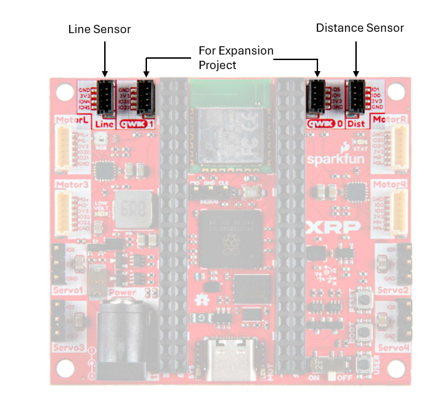

---

## Ultrasonic Distance Sensor

Plug into the port labeled **"Dist"** on the controller board.

<table><tr>
<td width="50%">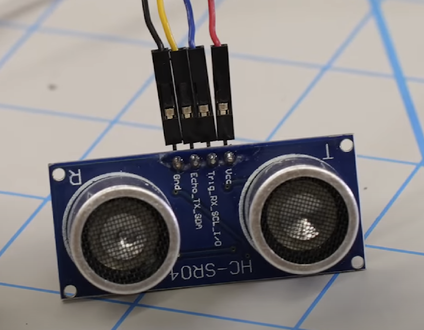</td>
<td width="50%">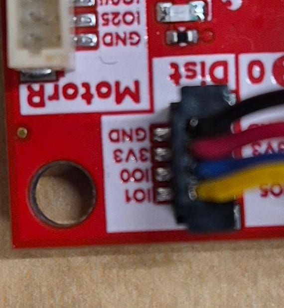</td>
</tr></table>

Wire orientation matters — the connector maps the sensor's echo and trigger lines to the board:

| Sensor Pin | Wire Color | Board Pin |
|---|---|---|
| VCC | Red | 3V3 |
| Trigger | Blue | IO1 |
| Echo | Yellow | IO0 |
| GND | Black | GND |

The connector should click into place. Do not force it.

> <span style="color: red;">**REVIEW NOTE:**</span> Insert annotated photo showing correct blue/yellow wire orientation for the distance sensor on the red board. Include a clear diagram of which color wire goes where.

---

## IR Reflectance / Line Sensor

Plug into the port labeled **"Line"** on the controller board.

<table><tr>
<td width="50%"></td>
<td width="50%">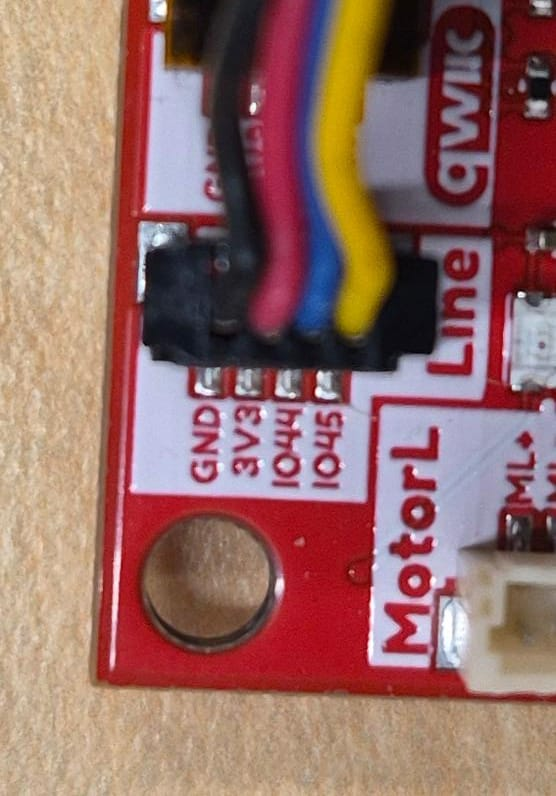</td>
</tr></table>

- Make sure the sensor faces **downward** toward the driving surface.
- Returns values from low (white/reflective surface) to high (black/dark surface).

---

## Color Sensor (TCS-34725)
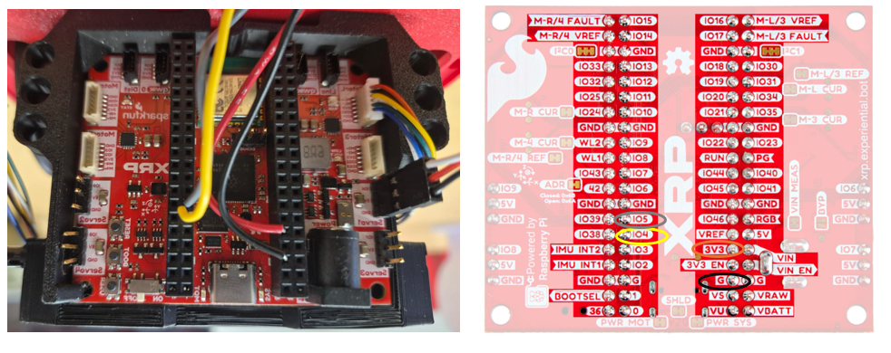
<table><tr>
<td width="50%">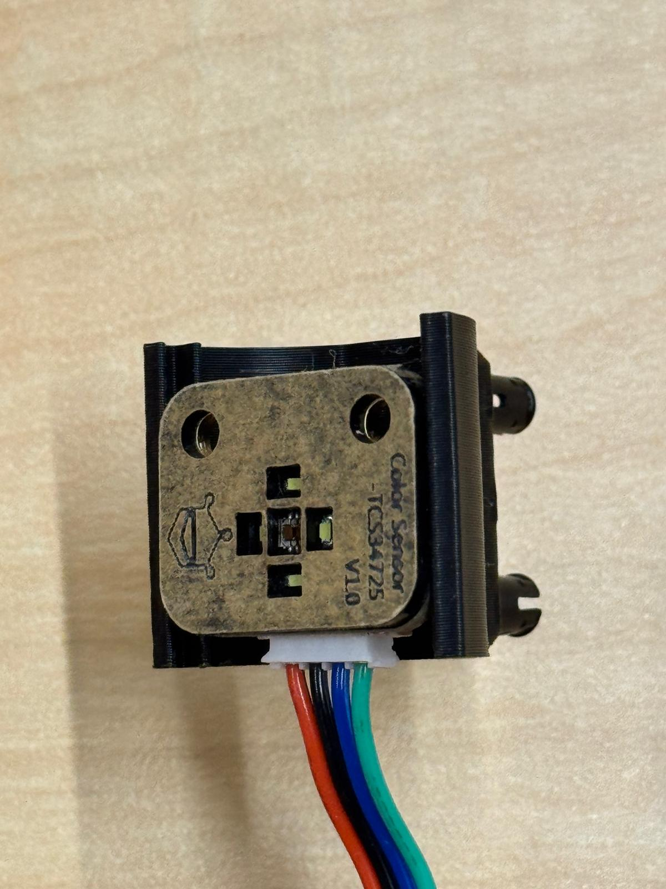</td>
<td width="50%">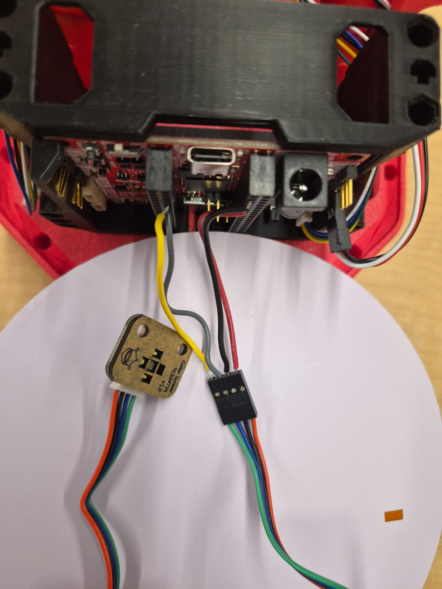</td>
</tr></table>

### Setup

Connect via the **Qwiic 0** port using the following wiring:

| Wire Color | Board Pin |
|---|---|
| Red | 3.3V |
| Black | GND |
| Yellow | Qwiic0 SDA (Pin 4) |
| Grey | Qwiic0 SCL (Pin 5) |

If the leads disconnect from the sensor header: yellow attaches to green, grey to blue, red to red, black to black.

**Library setup:**

1. Download `tcs3472.py` from: [tcs3472-micropython on GitHub](https://github.com/your-link-here) (click the download icon)
2. Upload it to the `/lib/` directory on your XRP.
3. **Important:** Open the file on the XRP and comment out or delete line 15.

> <span style="color: red;">**REVIEW NOTE:**</span> Verify what is on line 15 of the current version of tcs3472.py and confirm this step is still needed.

> <span style="color: red;">**REVIEW NOTE:**</span> Verify these pin mappings for the red controller board. Insert clear photo of correct color sensor wiring.

### Reading RGB Values

```python
from machine import Pin, I2C
from tcs3472 import tcs3472
from time import sleep_ms

i2c_bus = I2C(0, sda=Pin(4), scl=Pin(5))
tcs = tcs3472(i2c_bus)

while True:
    print("RGB:", tcs.rgb())
    sleep_ms(1000)
```

The `tcs.rgb()` function returns a tuple of three values `(Red, Green, Blue)`. Use these values to identify colors programmatically.

---

## Touch Sensor / Digital Button

<table><tr>
<td width="50%">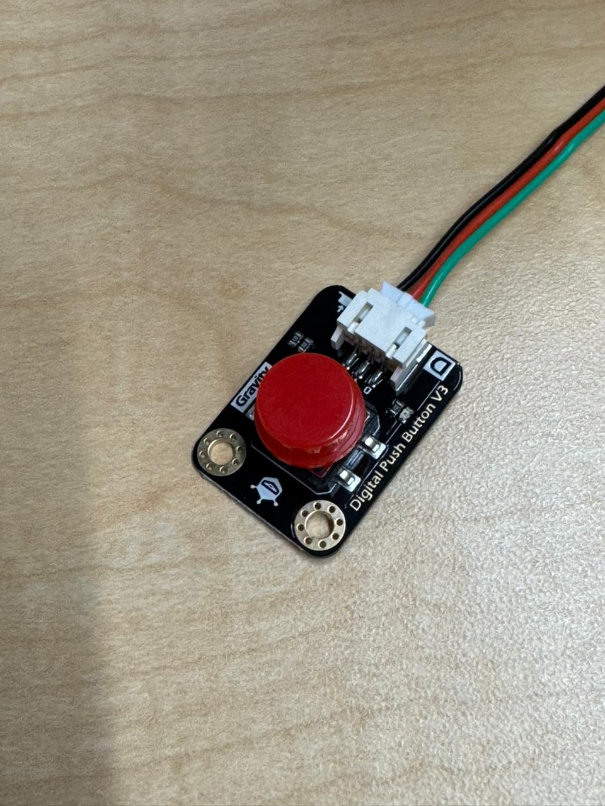</td>
<td width="50%">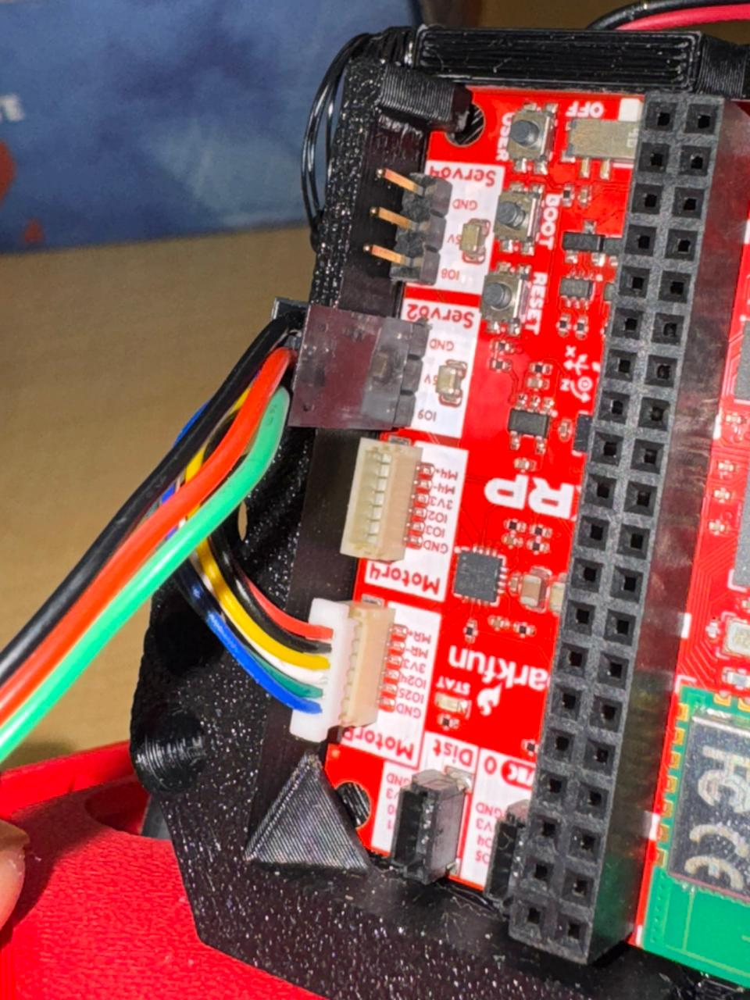</td>
</tr></table>

Connect to any Servo extension pin. Recommended: **Servo 2 (Pin 9)**:

| Wire Color | Board Pin |
|---|---|
| Black | GND |
| Red | 5V |
| Signal | IO9 |

> <span style="color: red;">**REVIEW NOTE:**</span> Insert photo of touch sensor wiring on the red board.

See [Skill 6 in Programming](programming.md#skill-6-using-the-touch-sensor-digital-push-button) for the code.

---

## Servo Motor

<table><tr>
<td width="50%">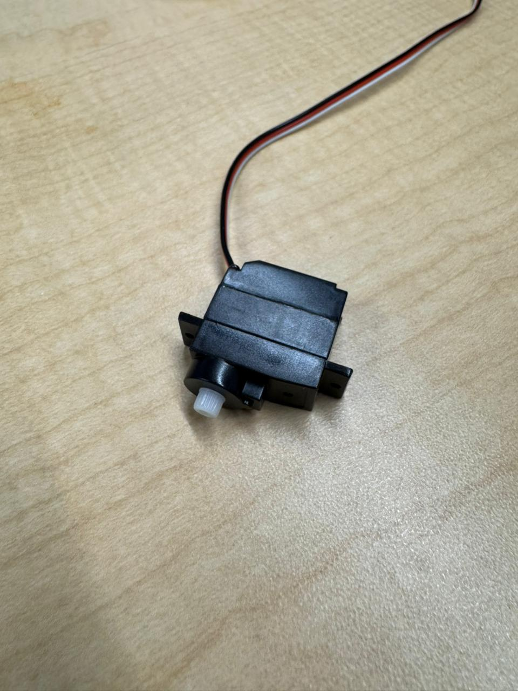</td>
<td width="50%">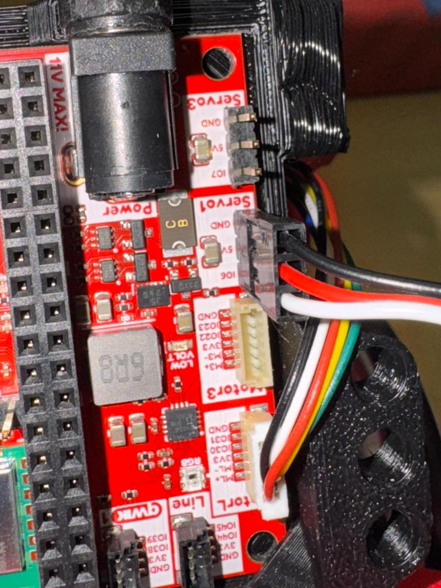</td>
</tr></table>

The servo should already be connected. It plugs into the **Servo 1** port by default.

See [Skill 3 in Programming](programming.md#skill-3-programmatically-controlling-the-servo) for usage and important warnings.
